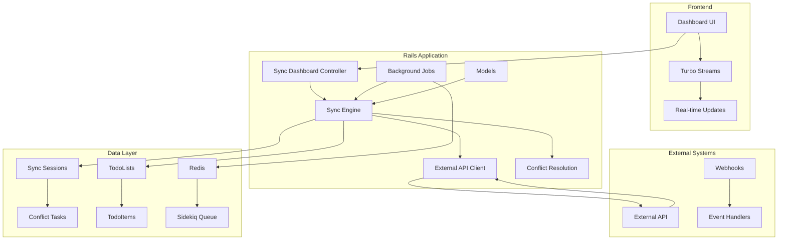

# 🔄 Sistema de Sincronización Bidireccional

## 📋 Tabla de Contenidos
- [Visión General](#visión-general)
- [Arquitectura](#arquitectura)
- [Componentes Principales](#componentes-principales)
- [Flujo de Sincronización](#flujo-de-sincronización)
- [Resolución de Conflictos](#resolución-de-conflictos)
- [API Reference](#api-reference)
- [Configuración](#configuración)
- [Monitoreo y Debugging](#monitoreo-y-debugging)
- [Testing](#testing)
- [Troubleshooting](#troubleshooting)

## 🎯 Visión General

El Sistema de Sincronización Bidireccional es una implementación completa basada en el **Plan de Acción Crunchloop** que permite la sincronización en tiempo real entre una API local (Rails) y una API externa. Implementa la **Opción 4: Rails Híbrido Inteligente** con las siguientes características:

### ✅ Características Principales
- **Sincronización bidireccional** automática y manual
- **Detección inteligente de conflictos** con múltiples estrategias de resolución
- **Dashboard en tiempo real** para monitoreo y control
- **Procesamiento en background** con Sidekiq
- **Cliente API externa** con manejo robusto de errores
- **Métricas y observabilidad** completas

### 🎯 Casos de Uso
- **Integración con sistemas externos** (CRM, ERP, etc.)
- **Sincronización de datos** entre múltiples aplicaciones
- **Backup y replicación** de datos críticos
- **Migración de datos** entre sistemas
- **APIs distribuidas** con consistencia eventual

## 🏗️ Arquitectura



### 🔄 Flujo de Datos

1. **Detección de Cambios**: El sistema detecta cambios en TodoLists/TodoItems
2. **Creación de Job**: Se crea un `BidirectionalSyncJob` en la cola de Sidekiq
3. **Procesamiento**: El job ejecuta el `SyncEngine` con la estrategia configurada
4. **Comunicación Externa**: El `ExternalApiClient` se comunica con la API externa
5. **Resolución de Conflictos**: Se detectan y resuelven conflictos automáticamente
6. **Actualización de Datos**: Se aplican los cambios en ambas direcciones
7. **Notificación**: Se envían actualizaciones en tiempo real via Turbo Streams

## 🧩 Componentes Principales

### 1. SyncEngine (`app/services/sync_engine.rb`)

**Responsabilidad**: Motor principal de sincronización bidireccional.

```ruby
# Inicialización
sync_engine = SyncEngine.new(
  todo_list: todo_list,
  external_api_client: ExternalApiClient.new,
  sync_strategy: 'incremental_sync',
  conflict_resolution_strategy: 'last_write_wins'
)

# Ejecución
results = sync_engine.perform_bidirectional_sync
```

**Métodos Principales**:
- `perform_bidirectional_sync`: Ejecuta la sincronización completa
- `detect_local_changes`: Detecta cambios locales desde la última sync
- `fetch_remote_changes`: Obtiene cambios desde la API externa
- `detect_conflicts`: Identifica conflictos entre cambios locales y remotos
- `resolve_conflicts`: Aplica estrategias de resolución de conflictos
- `apply_sync_changes`: Aplica los cambios sincronizados

### 2. ExternalApiClient (`app/services/external_api_client.rb`)

**Responsabilidad**: Cliente HTTP para comunicación con API externa.

```ruby
# Inicialización
client = ExternalApiClient.new(
  api_key: 'your_api_key',
  base_url: 'https://api.external.com'
)

# Operaciones
client.fetch_todo_list(external_id)
client.create_resource('todo_item', data)
client.update_resource('todo_item', external_id, data)
client.delete_resource('todo_item', external_id)
client.health_check
```

**Características**:
- **Retry automático** con backoff exponencial
- **Rate limiting** y manejo de errores 429
- **Timeouts configurables** (default: 30s)
- **Health checks** y monitoreo de conectividad
- **Modo simulación** para desarrollo

### 3. BidirectionalSyncJob (`app/jobs/bidirectional_sync_job.rb`)

**Responsabilidad**: Job de background para procesamiento asíncrono.

```ruby
# Enqueue job
BidirectionalSyncJob.perform_later(
  todo_list_id,
  sync_strategy: 'incremental_sync',
  conflict_resolution_strategy: 'last_write_wins'
)
```

**Características**:
- **Retry automático** con estrategias configurables
- **Broadcasting en tiempo real** via Turbo Streams
- **Métricas de performance** y logging detallado
- **Auto-resolución de conflictos** cuando es posible
- **Programación de próxima sync** automática

### 4. ConflictResolutionTask (`app/models/conflict_resolution_task.rb`)

**Responsabilidad**: Manejo y resolución de conflictos de sincronización.

```ruby
# Crear conflicto
conflict = ConflictResolutionTask.create!(
  sync_session: session,
  conflict_type: 'data_conflict',
  local_data: local_changes,
  remote_data: remote_changes
)

# Auto-resolución
conflict.attempt_auto_resolution

# Resolución manual
conflict.manual_resolve!(resolution_data, resolved_by: 'admin')
```

**Estrategias de Resolución**:
- `last_write_wins`: Usa el timestamp más reciente
- `merge_changes`: Combina ambos cambios
- `external_priority`: Prioriza cambios externos
- `local_priority`: Prioriza cambios locales
- `manual_resolution`: Requiere intervención humana

### 5. SyncSession (`app/models/sync_session.rb`)

**Responsabilidad**: Tracking de sesiones de sincronización.

```ruby
# Crear sesión
session = SyncSession.create!(
  todo_list: todo_list,
  strategy: 'incremental_sync',
  status: 'initiated'
)

# Obtener estadísticas
stats = session.summary
duration = session.duration_in_words
success_rate = session.success_rate
```

**Estados**:
- `initiated`: Sesión creada
- `running`: En proceso
- `completed`: Completada exitosamente
- `failed`: Falló con error
- `paused`: Pausada temporalmente
- `cancelled`: Cancelada por usuario

## 🔄 Flujo de Sincronización

### 1. Iniciación
```ruby
# Habilitar sync para una lista
todo_list.enable_sync!(external_id: "ext_123")

# Trigger manual
todo_list.trigger_sync!(strategy: 'incremental_sync')
```

### 2. Detección de Cambios
```ruby
# El sistema detecta automáticamente:
# - TodoItems creados/modificados
# - TodoList actualizada
# - Cambios en campos tracked (description, completed, etc.)
```

### 3. Procesamiento
```ruby
# Job en background
BidirectionalSyncJob.perform_later(todo_list_id)

# El job ejecuta:
# 1. detect_local_changes
# 2. fetch_remote_changes  
# 3. detect_conflicts
# 4. resolve_conflicts
# 5. apply_sync_changes
```

### 4. Aplicación de Cambios
```ruby
# Cambios locales → API externa
client.create_resource('todo_item', local_data)
client.update_resource('todo_item', external_id, local_data)

# Cambios remotos → Base de datos local
TodoItem.create!(description: remote_data['description'])
todo_item.update!(completed: remote_data['completed'])
```

## ⚠️ Resolución de Conflictos

### Tipos de Conflictos

| Tipo | Descripción | Ejemplo |
|------|-------------|---------|
| `data_conflict` | Datos diferentes | Descripción modificada en ambos lados |
| `timestamp_conflict` | Timestamps inconsistentes | Mismo item, diferentes updated_at |
| `deletion_conflict` | Eliminación vs modificación | Item eliminado localmente, modificado remotamente |
| `creation_conflict` | Creación duplicada | Item creado en ambos lados simultáneamente |

### Estrategias de Resolución

#### 1. Last Write Wins
```ruby
# Usa el timestamp más reciente
if local_timestamp > remote_timestamp
  use_local_changes
else
  use_remote_changes
end
```

#### 2. Merge Changes
```ruby
# Combina cambios inteligentemente
merged_data = local_data.merge(remote_data) do |key, local_val, remote_val|
  case key
  when 'description'
    "#{local_val} (merged with: #{remote_val})"
  when 'completed'
    local_val || remote_val  # True wins
  else
    remote_val  # Default: remote wins
  end
end
```

#### 3. Auto-Resolution
```ruby
# Resolución automática basada en reglas
def auto_resolvable?
  conflict_summary.all? do |diff|
    case diff[:field]
    when 'completed'
      diff[:local] == true || diff[:remote] == true
    when 'updated_at'
      true  # Timestamp conflicts can be auto-resolved
    else
      false  # Other fields need manual review
    end
  end
end
```

## 📚 API Reference

### SyncEngine

```ruby
class SyncEngine
  # Inicialización
  def initialize(todo_list:, external_api_client: nil, sync_strategy: 'incremental_sync', conflict_resolution_strategy: 'last_write_wins')
  
  # Método principal
  def perform_bidirectional_sync
  
  # Detección de cambios
  def detect_local_changes
  def fetch_remote_changes
  
  # Resolución de conflictos
  def detect_conflicts(local_changes, remote_changes)
  def resolve_conflicts(conflicts)
  
  # Aplicación de cambios
  def apply_sync_changes(local_changes, remote_changes, resolved_changes)
end
```

### ExternalApiClient

```ruby
class ExternalApiClient
  # Inicialización
  def initialize(api_key: nil, base_url: nil)
  
  # Operaciones CRUD
  def fetch_todo_list(external_id)
  def create_resource(resource_type, data)
  def update_resource(resource_type, external_id, data)
  def delete_resource(resource_type, external_id)
  
  # Monitoreo
  def health_check
  def sync_stats
  
  # Manejo de errores
  def with_error_handling
  def retry_request
end
```

### TodoList (Extended)

```ruby
class TodoList
  # Sync control
  def enable_sync!(external_id: nil)
  def disable_sync!
  def trigger_sync!(strategy: 'incremental_sync', conflict_resolution: 'last_write_wins')
  
  # Status checking
  def sync_enabled?
  def needs_sync?
  def sync_status
  def sync_stats
  
  # Scopes
  scope :sync_enabled
  scope :needs_sync
end
```

## ⚙️ Configuración

### Variables de Entorno

```bash
# API Externa
EXTERNAL_API_KEY=your_api_key_here
EXTERNAL_API_BASE_URL=https://api.external.com/api/v1

# Redis (para Sidekiq)
REDIS_URL=redis://localhost:6379/0

# Configuración de Sync
SYNC_DEFAULT_STRATEGY=incremental_sync
SYNC_DEFAULT_CONFLICT_RESOLUTION=last_write_wins
SYNC_RETRY_ATTEMPTS=3
SYNC_TIMEOUT_SECONDS=30
```

### Configuración de Rails

```ruby
# config/application.rb
config.sync = ActiveSupport::OrderedOptions.new
config.sync.default_strategy = 'incremental_sync'
config.sync.default_conflict_resolution = 'last_write_wins'
config.sync.retry_attempts = 3
config.sync.timeout_seconds = 30
```

### Configuración de Sidekiq

```ruby
# config/initializers/sidekiq.rb
Sidekiq.configure_server do |config|
  config.redis = { url: ENV['REDIS_URL'] }
  
  # Configuración específica para sync jobs
  config.queues = %w[default sync critical]
end
```

## 📊 Monitoreo y Debugging

### Logs Estructurados

```ruby
# Ejemplo de logs del sistema
Rails.logger.info "🔄 Starting bidirectional sync for TodoList #{todo_list.id}"
Rails.logger.info "📊 Strategy: #{sync_strategy}, Conflict Resolution: #{conflict_resolution_strategy}"
Rails.logger.info "📈 Local changes: #{local_changes.count}, Remote changes: #{remote_changes.count}"
Rails.logger.info "⚠️ Detected #{conflicts.count} conflicts"
Rails.logger.info "✅ Sync completed successfully"
```

### Métricas de Performance

```ruby
# Métricas disponibles
SyncSession.average_duration
SyncSession.success_rate_overall
ConflictResolutionTask.auto_resolution_rate
ExternalApiClient.health_check['latency']
```

### Dashboard de Monitoreo

**URLs de Monitoreo**:
- **Dashboard Principal**: `/sync_dashboard`
- **API Health**: `/sync_dashboard/api_health`
- **Estadísticas**: `/sync_dashboard/stats`
- **Sesiones**: `/sync_dashboard/sessions`
- **Conflictos**: `/sync_dashboard/conflicts`

## 🧪 Testing

### Tests Unitarios

```ruby
# spec/services/sync_engine_spec.rb
RSpec.describe SyncEngine do
  let(:todo_list) { create(:todo_list) }
  let(:sync_engine) { SyncEngine.new(todo_list: todo_list) }
  
  describe '#perform_bidirectional_sync' do
    it 'syncs changes successfully' do
      expect(sync_engine.perform_bidirectional_sync).to be_successful
    end
  end
end
```

### Tests de Integración

```ruby
# spec/jobs/bidirectional_sync_job_spec.rb
RSpec.describe BidirectionalSyncJob do
  it 'processes sync job successfully' do
    expect {
      BidirectionalSyncJob.perform_now(todo_list.id)
    }.to change(SyncSession, :count).by(1)
  end
end
```

### Tests de API Externa

```ruby
# spec/services/external_api_client_spec.rb
RSpec.describe ExternalApiClient do
  let(:client) { ExternalApiClient.new }
  
  describe '#health_check' do
    it 'returns healthy status' do
      expect(client.health_check['status']).to eq('healthy')
    end
  end
end
```

## 🔧 Troubleshooting

### Problemas Comunes

#### 1. API Externa No Disponible
```ruby
# Error: External API is not available
# Solución: Verificar conectividad y configuración
client = ExternalApiClient.new
client.health_check
```

#### 2. Conflictos No Resueltos
```ruby
# Error: Conflicts pending resolution
# Solución: Revisar y resolver conflictos manualmente
ConflictResolutionTask.pending.each do |conflict|
  puts "Conflict #{conflict.id}: #{conflict.conflict_type}"
  puts "Auto-resolvable: #{conflict.auto_resolvable?}"
end
```

#### 3. Jobs Fallando
```ruby
# Error: Sync jobs failing
# Solución: Revisar logs de Sidekiq
# Acceder a: http://localhost:3000/sidekiq
```

#### 4. Performance Lenta
```ruby
# Error: Sync taking too long
# Solución: Optimizar estrategia y revisar métricas
SyncSession.where('duration > ?', 60.seconds).each do |session|
  puts "Slow session: #{session.id} - #{session.duration}s"
end
```

### Comandos de Debugging

```ruby
# Rails console debugging
# 1. Verificar estado de sync
TodoList.sync_enabled.each do |list|
  puts "#{list.name}: #{list.sync_status}"
end

# 2. Revisar conflictos pendientes
ConflictResolutionTask.pending.each do |conflict|
  puts "Conflict: #{conflict.conflict_type} - #{conflict.time_since_created}"
end

# 3. Verificar jobs en cola
require 'sidekiq/api'
Sidekiq::Queue.new.size

# 4. Limpiar datos de prueba
SyncSession.destroy_all
ConflictResolutionTask.destroy_all
```

### Logs de Debugging

```bash
# Ver logs en tiempo real
tail -f log/development.log | grep "🔄\|📊\|⚠️\|✅\|❌"

# Filtrar logs de sync
grep "Sync" log/development.log

# Ver logs de Sidekiq
tail -f log/sidekiq.log
```

---

## 📞 Soporte

Para soporte técnico o preguntas sobre el sistema de sincronización:

1. **Revisar logs** en `log/development.log`
2. **Verificar dashboard** en `/sync_dashboard`
3. **Consultar documentación** en este archivo
4. **Ejecutar comandos de debugging** en Rails console

---

*Documentación generada automáticamente - Sistema de Sincronización Bidireccional v1.0*
